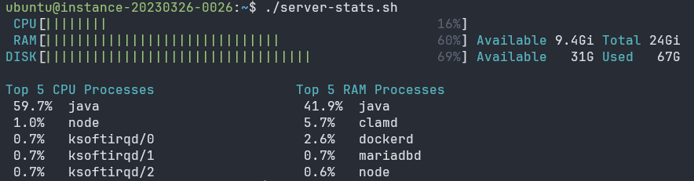

# Server Performance Stats
Write a script to analyse basic server performance stats.

## Requirements
You are required to write a script server-stats.sh that can analyse basic server performance stats. You should be able to run the script on any Linux server and it should give you the following stats:
- Total CPU usage
- Total memory usage (Free vs Used including percentage)
- Total disk usage (Free vs Used including percentage)
- Top 5 processes by CPU usage
- Top 5 processes by memory usage

Stretch goal: Feel free to optionally add more stats such as os version, uptime, load average, logged in users, failed login attempts etc.

[A roadmap.sh project](https://roadmap.sh/projects/server-stats)

# Preview



# Usage

To use the `server-stats.sh` script, follow these steps:

1. Ensure the script has execution permissions. If not, you can add them with the command:
    ```sh
    chmod +x server-stats.sh
    ```

2. Run the script on your Linux server using the following command:
    ```sh
    ./server-stats.sh
    ```

The script will display the following server performance statistics:
- Total CPU usage
- Total memory usage
- Total disk usage
- Top 5 processes by CPU usage
- Top 5 processes by memory usage

You can also use the following options for specific statistics:
- `-c, --cpu` : Show CPU utilization
- `-m, --mem` : Show memory utilization
- `-d, --disk` : Show disk usage
- `-t, --top` : Show top 5 processes by CPU and memory usage side by side
- `--top_ram` : Show top 5 processes by memory usage
- `--top_cpu` : Show top 5 processes by CPU usage
- `-h, --help` : Show the help message